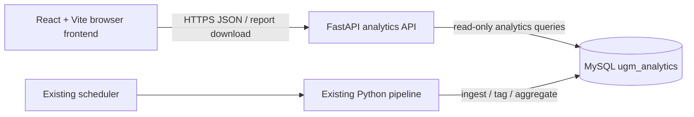

# PRD — Frontend Analytics Non-Streamlit

## Status
Proposed. Planning artifact only; no application, schema, deployment, credential, or pipeline change is authorized by this document.

## Problem and opportunity

The public analytics experience is currently rendered by Streamlit. Page rendering, browser state, MySQL reads, chart preparation, Word-report controls, and parts of operational status are coupled inside Streamlit modules. This prevents a standalone web frontend and causes the dashboard to load broad datasets in process rather than exposing a bounded browser-facing contract.

The migration must replace the public analytics UI without changing the meanings, calculations, taxonomy, existing visual identity, or operational pipeline. The current Streamlit dashboard remains the behavioral baseline until the replacement passes parity verification.

## Users and stakeholders

| User or stakeholder | Need |
|---|---|
| UGM impact analyst | Filter, interpret, inspect, and export analytics without relearning the dashboard. |
| UGM unit/faculty manager | Review data related to impact pillars, official Kepmen themes, SDGs, and units. |
| Public dashboard visitor | Understand the available public analytics and follow source-news links. |
| Data administrator | Continue the existing periodic pipeline without frontend-dependent changes. |
| Infrastructure team | Receive deployable frontend and API services with bounded environment contracts. |

## Goals

1. Deliver a standalone public analytics frontend with React + Vite, not Streamlit.
2. Introduce a FastAPI read API as the only browser-facing access path to analytics data.
3. Preserve functional and numerical parity with the existing Streamlit public analytics dashboard.
4. Preserve the existing UGM visual language and information hierarchy; this is a platform migration, not a visual redesign.
5. Retain the existing MySQL tables, Python ingest/tagging pipeline, official mapping source, and Word report generation logic.
6. Support accessible, responsive use across desktop, tablet, and mobile widths.
7. Keep Streamlit available as the rollback baseline during parallel validation.
8. Keep the frontend as a client-side dashboard application: filter state in the browser, JSON from FastAPI, and no unneeded SSR or Node application runtime.

## Non-goals

- Rewriting the RSS/sitemap ingestion, normalisation, tagging, or scheduled update pipeline.
- Changing the Kepmen 361/2025, SDG, keyword, or unit-work taxonomy.
- Replacing MySQL or migrating analytics tables in phase one.
- Redesigning public pages, creating new branding, or changing the established navigation/content order without an approved reason.
- Migrating the accreditation UI, login, profile, admin, uploads, extraction AI, or accreditation DOCX workflow in phase one.
- Exposing MySQL, LLM credentials, pipeline subprocess execution, or filesystem paths to a browser.
- Production deployment, DNS, reverse-proxy, container lifecycle, or scheduler changes.

## Scope

### In scope: phase one, public analytics

- Routes equivalent to the current Beranda, Dampak, Dampak × SDGs, and SDGs pages.
- Keyword search and interpretation equivalent to `berita-dampak/pencarian.py`.
- Filter UI and URL-shareable filter state for year, impact pillar, official topic, SDG, and unit where each is applicable.
- Executive metrics, dynamic insight/narrative, charts, mapping/reference content, news tables, and manual-review unmatched lists.
- Server-side filtering, aggregation, sorting, and pagination.
- Word-report generation using validated active filters.
- Read-only display of current update/data status.
- Explicit loading, empty, error, and stale-data states.
- FastAPI API contract, input validation, CORS allowlist, and test coverage supporting these public routes.
- Parallel operation with the existing Streamlit analytics dashboard.

### Frontend platform constraint

The public frontend MUST use React + Vite as a client-side SPA. Routing uses React Router or an equivalent client-side router. FastAPI owns every server operation, including data reads, filter validation, report generation, and future authenticated actions. The Vite app MUST be buildable as static assets and MUST NOT add an alternate Node.js API/runtime boundary.

**Rationale:** the existing product is an interactive analytics dashboard whose dominant interaction is persistent navigation plus client-side filter changes. Vite provides the closest operational shape to Streamlit without adding SSR or server-component features that the approved scope does not need.

### Deferred: accreditation phase

The accreditation module remains Streamlit-backed during phase one. Before it can move to a non-Streamlit frontend, its API design must include:

- server-issued `HttpOnly; Secure; SameSite=Strict` session cookies;
- program-scoped access roles for UGM accounts;
- append-only accreditation action audit records;
- authorized file download/upload containment and type/size checks;
- approved LLM egress, disclosure, and extraction-job boundary;
- role and authorization tests against every read/write endpoint.

## Existing system evidence

| Area | Verified current source |
|---|---|
| Public page routing | `berita-dampak/dashboard_berita_dampak.py`, `berita-dampak/pages_app/` |
| Shared dashboard data loading | `berita-dampak/data_loader.py` |
| Impact modes, filters, analytics, and update status | `berita-dampak/page_dampak.py` |
| Direct-SDG analytics | `berita-dampak/page_sdgs.py` |
| Search interpretation | `berita-dampak/pencarian.py` |
| Official Kepmen/SDG mapping | `berita-dampak/scripts/kepmen_sdg.py` |
| Dynamic insight calculation | `berita-dampak/scripts/narasi_logic.py` |
| Existing Word reporting | `berita-dampak/laporan_word.py` |
| Ingest/tagging/update pipeline | `berita-dampak/scripts/update_mingguan.py` and sibling scripts |
| Existing visual language and assets | `berita-dampak/common.py`, `shared/assets/logo/`, `berita-dampak/static/hero_bg.jpg` |

## Product requirements

### Functional requirements

#### FR-001 — Public application routes

The frontend MUST provide the following routes:

- `/` for Beranda;
- `/dampak` for the current “Berdampak” mode;
- `/dampak-sdgs` for the current “Berdampak × SDGs” mode;
- `/sdgs` for the current direct-SDG mode.

Every navigation item MUST resolve to an existing accessible route.

#### FR-002 — Search interpretation

A search query from Beranda MUST be interpreted using the same domain semantics as the current parser:

- accreditation-related terms route to the existing accreditation location only while that surface remains available;
- recognised official topic/pillar/SDG/year terms set applicable initial filters;
- direct SDG terms route to `/sdgs` unless combined with impact/theme terms, which route to `/dampak-sdgs`;
- unrecognised queries route to general impact analytics with an honest explanation.

Search results MUST be represented in the URL or equivalent shareable client state after navigation. A user can subsequently change the filters without their choice being overwritten.

#### FR-003 — Impact analytics parity

`/dampak` and `/dampak-sdgs` MUST support the same applicable filter dimensions as the current dashboard:

- inclusive year range;
- one or more impact pillars;
- official Kepmen topics, grouped by selected pillar;
- zero or more faculties/schools/work units.

The result MUST preserve current semantics:

- selected unit filtering intersects with applicable filters;
- unit-ranking views remain independent from a selected unit filter where the existing dashboard intentionally does so;
- selected official topics with no matches remain represented as zero-valued categories;
- default-filter narrative can use the current cached narrative only when its scope matches the active filters; otherwise the response uses accurate dynamic fallback text.

#### FR-004 — Direct-SDG analytics parity

`/sdgs` MUST use direct SDG tagging of sitemap data, not derived Kepmen-theme SDG associations. It MUST make the conceptual distinction visible: direct SDG matching and impact × SDG answer different questions and are not interchangeable.

#### FR-005 — Analytics content parity

For applicable modes and filters, the frontend MUST render the current user-visible content with equivalent data and labels:

- executive metrics and explanatory narrative;
- theme, pillar, SDG, year, and unit visualisations;
- official Kepmen mapping, indicators, formulas, and units where currently provided;
- seasonal/annual coverage and multi-topic views where applicable;
- keyword and word-frequency exploratory views where applicable;
- filtered news list with working source links;
- manual-review list for records without the relevant match.

A chart MUST answer an explicit analytical question. It MUST not be introduced or removed merely to change the visual layout.

#### FR-006 — Bounded data API

The browser MUST consume analytics data only through a FastAPI API. The API MUST:

- validate all filters against known values and ranges;
- use parameterised SQL values and fixed query structure;
- perform filtering, aggregation, sorting, and pagination server-side;
- enforce a bounded page size for lists;
- return data needed by the active screen, not unrestricted database tables;
- return source-news URLs only as public links, never database or filesystem configuration;
- return errors in a documented client-safe form.

#### FR-007 — Report generation

A user can request a Word report for the active supported mode and filters. The API MUST recompute/validate filters server-side and invoke existing report-domain logic or an equivalent tested implementation. It MUST NOT trust browser-supplied totals, narratives, tabular values, or filenames.

#### FR-008 — Update visibility

The frontend MUST show a truthful read-only data/update status. It MUST NOT imply a pipeline is running, fresh, or complete without evidence from the backend.

A browser-triggered pipeline update is explicitly deferred until operation ownership, authorization, locking, and audit expectations are agreed.

### Visual and interaction requirements

#### UX-001 — Preserve current visual language

The frontend MUST preserve these verified visual choices:

- UGM navy structure based on `#00214a`, `#052c5b`, and `#0a3364`;
- the existing `hero_bg.jpg` composition and current page-logo assets;
- navy metric cards and the current hierarchy of page title, filters, summary, insight, visualisations, and source tables;
- yellow `#ffc72c` as the constrained primary interaction/focus accent;
- pillar colours as data encoding, not general decoration.

The frontend MUST NOT introduce fabricated metrics, testimonials, customer claims, decorative status indicators, or generic landing-page sections.

#### UX-002 — Responsive behaviour

The desktop sidebar concept MAY become a labelled filter drawer on narrow widths. It MUST retain the same filter choices and current applied-filter visibility.

- No page has horizontal overflow at supported mobile widths.
- Data tables reflow into an accessible representation or use a contained horizontal scroll region with labels.
- Interactive targets are at least 44 by 44 CSS pixels.
- The last content is not covered by fixed navigation or filter controls.

#### UX-003 — Accessibility

The frontend MUST:

- support logical keyboard navigation and visible focus on all controls;
- expose controls, filters, charts, status, and errors with semantic labels;
- meet WCAG AA contrast, 4.5:1 normal text and 3:1 large text, and 3:1 non-text UI boundaries/focus indicators;
- include informative loading, empty, and error states for every data surface;
- preserve usable reflow at 200% text zoom.

#### UX-004 — Content integrity

All metrics, deltas, labels, and explanatory text MUST derive from data or verified official sources. UI copy must disclose rather than hide known analysis caveats, including keyword lower-bound behaviour, translation duplicate potential, and the difference between direct and theme-derived SDGs.

### Non-functional requirements

#### NFR-001 — Compatibility

The public API reads existing `berita_*` MySQL tables. Existing pipeline scripts continue to write them without requiring frontend participation.

#### NFR-002 — Security boundary

The frontend contains no MySQL password, OpenAI credential, database URL, filesystem path, or pipeline execution authority. CORS is restricted to approved frontend origin(s), with development values explicitly separated from production values.

#### NFR-003 — Performance

The API MUST avoid the existing pattern of sending full database tables to a dashboard process for every analytics view. The performance target is TBD until baseline response sizes and query timings are measured on representative data.

#### NFR-004 — Observability

API logs MUST include request correlation and safe error context, but MUST NOT contain credentials, session material, raw document contents, or unrestricted SQL data. Pipeline logs remain owned by the existing scheduled job boundary.

## User stories and acceptance criteria

### US-001 — Explore public impact analytics

As an analyst, I can open `/dampak`, choose a date range, pillars, topics, and optional unit, then understand the resulting impact analytics.

**Acceptance criteria**

1. Each filter is visible, keyboard-operable, and represented in a shareable URL.
2. Changing a filter updates all affected metrics, charts, insights, lists, and report output consistently.
3. A filter with no matches shows an explanatory empty state and a way to revise filters.
4. A topic selected by the user appears with value zero when it has no matching news, matching the current product rule.
5. The results equal the Streamlit baseline for the same controlled dataset and filter set.

### US-002 — Distinguish SDG analysis modes

As an analyst, I can choose direct SDG analysis or impact × SDG analysis without mistaking one for the other.

**Acceptance criteria**

1. `/sdgs` uses direct sitemap SDG tagging.
2. `/dampak-sdgs` uses the impact/Kepmen theme-based dataset.
3. Each page explains its source/method sufficiently for the user to distinguish them.
4. Equivalent filters reproduce the existing Streamlit counts for their respective data sources.

### US-003 — Find relevant analysis from free text

As a visitor, I can search “energi SDG 7 2024” and arrive at the matching analytics route with initial filters applied.

**Acceptance criteria**

1. Recognised terms resolve using the established keyword/taxonomy logic.
2. The landing page displays an explanation of how the query was interpreted.
3. The user can alter filters after arrival without automatic reset.
4. An unrecognised query does not create fictitious matches or claims.

### US-004 — Inspect supporting news

As an analyst, I can browse matching news records, follow public source links, and inspect unmatched records for manual review.

**Acceptance criteria**

1. The list is paginated server-side and exposes date, title, source, relevant labels, and a functional public source link.
2. The unmatched list uses the same active filter boundary and mode semantics as the current dashboard.
3. No record list request returns data beyond the declared list fields.

### US-005 — Export current analysis

As an analyst, I can generate a Word report representing the current selected mode and filters.

**Acceptance criteria**

1. The report identifies active filters and includes data derived by the server.
2. The report’s metrics and tables match the active API response.
3. Invalid or unsupported filters are rejected rather than silently coerced.
4. Download response uses a safe generated filename and correct DOCX content type.

## Proposed architecture and interfaces



### Proposed public endpoints

```text
GET  /api/v1/analytics/metadata
GET  /api/v1/analytics/home-summary
GET  /api/v1/analytics/search?q=
GET  /api/v1/analytics/impact
GET  /api/v1/analytics/sdgs
GET  /api/v1/analytics/news
GET  /api/v1/analytics/unmatched-news
POST /api/v1/analytics/reports
GET  /api/v1/analytics/refresh-status
GET  /healthz
```

Payload fields, error format, pagination, caching, and exact query parameters are TBD in `API.md`. Public route contracts must be fixed only after comparison against existing Streamlit output.

## Constraints and assumptions

| Type | Statement |
|---|---|
| Verified | Public analytics currently uses MySQL tables prefixed `berita_`. |
| Verified | Existing update pipeline is `berita-dampak/scripts/update_mingguan.py` and is independently runnable. |
| Verified | Existing Streamlit UI includes public analytics and a separate accreditation surface. |
| Verified | The repository currently has no JavaScript frontend scaffold or root JavaScript package manifest. |
| User-provided decision | Visual changes must be minimal as long as function is preserved. |
| User-provided decision | Analytics migrates before accreditation. |
| User-provided decision | Future accreditation access uses UGM accounts with explicit program assignment. |
| Decision | React + Vite is selected for the public analytics frontend because its client-side dashboard model most directly matches current Streamlit filter → rerender behaviour, while FastAPI remains the full backend boundary. |
| Proposed | Vite and FastAPI will be added in top-level `web/` and `api/` directories. The Vite build output is static assets suitable for an approved web server or reverse proxy. |
| Non-goal | Next.js SSR, Server Components, Next API routes, and a Node application runtime are not part of this phase. |
| TBD | Deployment topology, frontend/API domains, reverse proxy, runtime versions, and ownership are decided by infrastructure stakeholders. |
| TBD | API performance SLOs after representative baseline measurement. |

## Success measures

No quantitative product baseline is currently verified. The migration is successful when:

1. all phase-one user stories and acceptance criteria pass;
2. the parity matrix passes for each supported filter/mode scenario;
3. no material numerical mismatch with Streamlit is unresolved;
4. desktop, tablet, mobile, and keyboard browser verification pass with no console errors;
5. UAT users who currently use the dashboard can complete equivalent analysis and export tasks;
6. the public application runs without Streamlit in its request path;
7. Streamlit rollback remains possible until a separately approved retirement decision.

## Risks and open questions

| Risk or question | Status / response |
|---|---|
| API calculations could drift from pandas/Streamlit semantics. | Mitigate by extracting/reusing domain logic first and testing fixtures plus parity scenarios before SQL optimisation. |
| Existing architecture documentation contains time-sensitive historic counts. | Treat live MySQL/API output as authoritative for runtime verification; do not hardcode documented counts. |
| Current public dashboard has update-button subprocess behaviour. | Defer write-trigger endpoint; preserve only truthful status in phase one. |
| Large datasets can produce expensive queries and payloads. | Measure baseline; use server-side aggregation/pagination; add indexes only from evidenced query plans. |
| Deployment is external to this repo. | API/FE implementation can proceed locally; deployment remains blocked pending infra decision and approval. |
| Accreditation has cross-program authorization and sensitive-document risks. | Explicitly out of scope until RBAC, audit, session, upload, and LLM boundaries are designed and verified. |
| Visual regression could confuse existing users. | Treat current layout, assets, labels, section order, and hierarchy as parity requirements; changes need a written reason. |

## Dependencies and related documents

- `docs/ARCHITECTURE-UGM-ANALYTICS-DAMPAK-vNEXT.md`
- `docs/FRAMEWORK.md`
- `berita-dampak/DASHBOARD.md`
- `berita-dampak/PIPELINE.md`
- `berita-dampak/common.py`
- `berita-dampak/page_dampak.py`
- `berita-dampak/page_sdgs.py`
- `berita-dampak/pencarian.py`
- `berita-dampak/laporan_word.py`
- `akreditasi/DASHBOARD.md`
- Future proposed documents: `docs/API.md`, `docs/SECURITY.md`, `web/DESIGN.md`, and an ADR confirming the React + Vite / FastAPI boundary.
